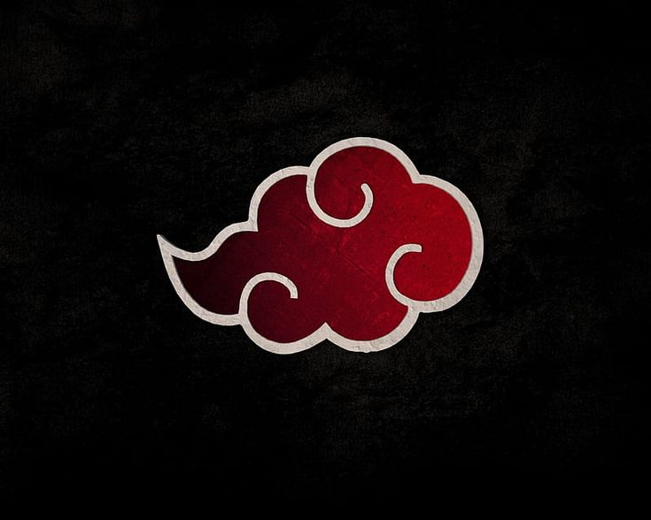
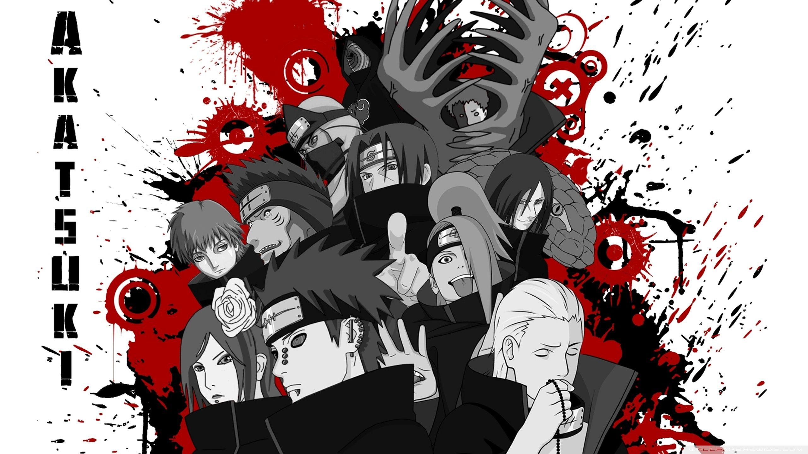

# Group 09 - Akatsuki

  

<strong>Strong individuals. One coordinated team.</strong>

&nbsp;

  

---

## Team Identity

Akatsuki is a team built on collaboration, discipline, and adaptability.  
Like our name suggests, we value the idea that different individuals with different strengths can come together to create something powerful, well-coordinated, and memorable.

---

## Team Values

- **Unity through different strengths**  
  Every member brings unique skills, ideas, and perspectives, and we value combining those strengths to build better solutions together.

- **Accountability to the team**  
  Each person is responsible for their work, deadlines, and communication so the whole team can move forward smoothly.

- **Clear and honest communication**  
  Strong teams rely on transparency, so we commit to asking questions early, sharing progress openly, and addressing blockers directly.

- **Discipline and consistency**  
  Good software is built through steady effort, attention to detail, and following through on commitments.

- **Growth through challenge**  
  We see mistakes, bugs, and setbacks as opportunities to improve both individually and as a team.

- **Respect for every role**  
  No contribution is too small. Planning, coding, documenting, testing, and reviewing all matter to the success of the project.

- **Strategic collaboration**  
  Like a well-coordinated team, we aim to work smart by dividing responsibilities clearly, supporting one another, and aligning on shared goals.

- **Adaptability under pressure**  
  When plans change or problems come up, we stay flexible, solution-oriented, and focused on progress.

- **Quality over shortcuts**  
  We value thoughtful work, clean code, and reliable solutions rather than rushing incomplete or careless results.

- **Shared vision**  
  We work as one team with one goal: to create a project we can all be proud of.

---

## Group Roster

___

### Aditya Jadhav
- [Github](https://github.com/AdityaJadhav17)
- [Portfolio](https://adityajadhav17.github.io/)
- Hobbies: I like Cooking, playing soccer, playing video games, and spending time with friends and family.

___

### James Villanueva
- [GitHub](https://github.com/JamesVillanueva-Dev)
- [Portfolio](https://jamesvillanueva-dev.github.io/Portfolio/)
- Hobbies: I like playing video games

___

### Alexis Navarrete
- [Github](https://github.com/AlexNav28)
- [Portfolio](http://www.linkedin.com/in/alexis-navarrete-62a9292b7)
- Hobbies: I like go to the gym, play sim racing online, and try new coffee shops.

___

### Daniel Wu
- [Github](https://github.com/dwu0501)
- [Portfolio](https://www.linkedin.com/in/daniel-wu-2407b1256/)
- Hobbies: I like to play some video games.

___

### Fahad Majidi
- [Github](https://github.com/Slazki)
- [Portfolio](https://www.linkedin.com/in/fahadmajidi)
- Hobbies: I like to play soccer, video games, spend some time with friends & family, playing with my parrot, and watching shows/movies.
  
___

### Hemendra Ande
- [Github](https://github.com/draande)
- [Portfolio](https://www.linkedin.com/in/hemendra-ande-a27a9528a/)
- Hobbies: I love watching movies, anime, shows, hiking, and playing on da cinco (ps5).
  
___

### Hieu Le
- [Github](https://github.com/hieule314)
- [Portfolio](https://www.linkedin.com/in/hieule314)
- Fun Facts: I have two dogs, my favorite anime is One Piece, and i have been playing badminton for 7+ years.
  
___

### Jason Nguyen
- [Github](https://github.com/J-rod-mech)
- [Portfolio](https://www.linkedin.com/in/jason-nguyen-jn1000/)
- Hobbies: I like playing tennis, video games, and I also like to cook.
  
___

### Josh Victoria
- [Github](https://github.com/Dez-catus)
- [Portfolio](https://www.linkedin.com/in/josh-victoria/)
- Hobbies: I really like to explore San Diego and find some new coffee spots.

___

### Waleed Alghaithi
- [Github](https://github.com/waleedA13)
- [Portfolio](https://waleeda13.github.io/110_Lab_1/)
- Hobbies: I enjoy exploring new places, playing billiards, video games, hooping, and just chilling with my friends.
  
___

### Woosik Kim
- [Github](https://github.com/woosik-study)
- [Portfolio](https://www.linkedin.com/in/woosikkim-ucsd)
- Fun Facts/Hobbies: I like to go to gym and workout when i have a free time, I also like watching movies, and a fun fact about me is that I went to military and did a squad leader training session.

___
